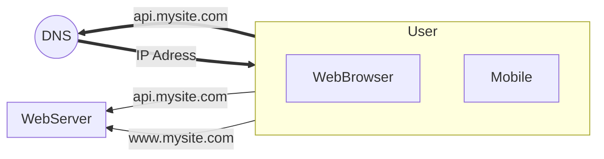

```mermaid

flowchart RL
    subgraph User
    WebBrowser
    Mobile
    end
    
    DNS(("DNS"))
    
    User == api.mysite.com==> DNS
    DNS == IP Adress==> User
    
    User -- api.mysite.com --> WebServer
    User -- www.mysite.com --> WebServer

    subgraph WebServer

    end
```