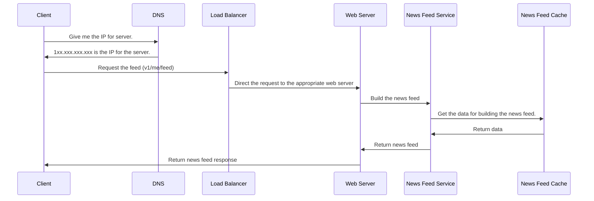

```mermaid

sequenceDiagram
    participant user as Client
    participant dns_server as DNS
    participant load_balancer as Load Balancer
    participant web_server as Web Server
    participant news_feed_service as News Feed Service
    participant news_feed_cache as News Feed Cache
    user->>dns_server: Give me the IP for server.
    dns_server->>user: 1xx.xxx.xxx.xxx is the IP for the server.
    
    user->>load_balancer: Request the feed (v1/me/feed)
    load_balancer->>web_server: Direct the request to the appropriate web server
    web_server->>news_feed_service: Build the news feed
    news_feed_service->>news_feed_cache: Get the data for building the news feed.
    news_feed_cache->>news_feed_service: Return data
    news_feed_service->>web_server: Return news feed
    web_server->>user: Return news feed response
    
```
