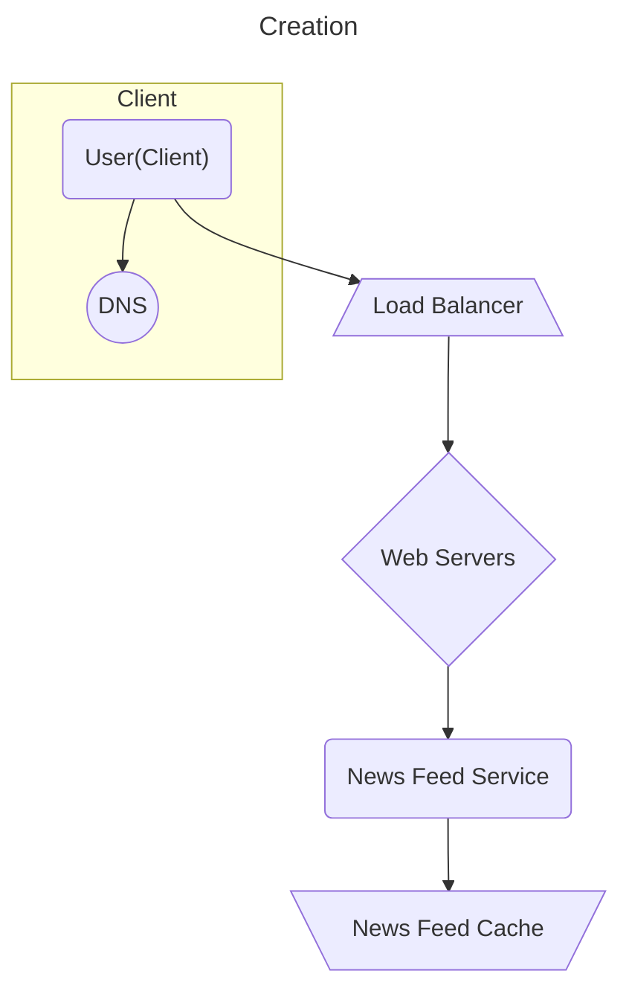

```mermaid
---
title: Creation
---
flowchart TD
    user("User(Client)")
    load_balancer[/"Load Balancer"\]
    web_servers{"Web Servers"}
    
    news_feed_service("News Feed Service")
    
    news_feed_cache[\News Feed Cache/]

    subgraph Client
        direction LR
        user --> DNS(("DNS"))
    end

    user --> load_balancer
    load_balancer --> web_servers

    web_servers --> news_feed_service
    news_feed_service --> news_feed_cache

```
