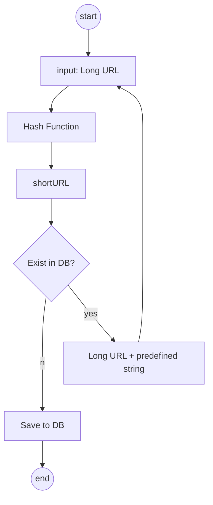

```mermaid
flowchart TD

    start((start)) --> input[input: Long URL]--> HF[Hash Function] --> shortURL--> exists

    exists{Exist in DB?}
    longURL[Long URL + predefined string]
    exists --no--> save[Save to DB] --> End((end))
    exists --yes--> longURL --> input


```